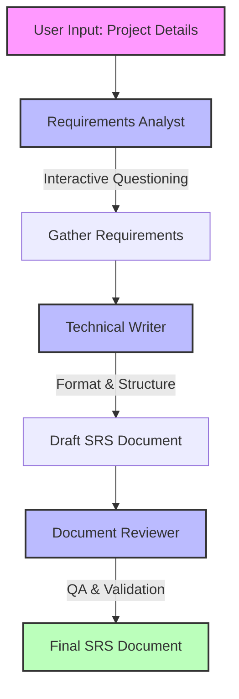

# AI-Powered SRS Generator

A CrewAI-based system for generating Software Requirements Specifications (SRS) documents through collaborative AI agents.

## Overview

The AI SRS Generator automates and streamlines the process of creating comprehensive Software Requirements Specifications documents. Using a crew of specialized AI agents, the system guides users through an interactive requirements gathering process, transforms gathered information into a well-structured document, and performs quality assurance checks to ensure completeness and consistency.

## System Architecture

The system implements a multi-agent approach using CrewAI, with each agent specializing in different aspects of the SRS development process:



### Agent Roles

1. **Requirements Analyst**

   - Engages with stakeholders through targeted questioning
   - Extracts clear, actionable requirements
   - Identifies gaps and inconsistencies proactively
   - Uses the RequirementsGathererTool to conduct interactive interviews

2. **Technical Writer**

   - Transforms raw requirements into structured SRS documentation
   - Applies industry-standard formatting and organization
   - Ensures technical accuracy and completeness
   - Uses the SRSFormatterTool for consistent document structure

3. **Document Reviewer**
   - Validates SRS document quality and consistency
   - Identifies ambiguities and contradictions
   - Ensures all requirements are testable and implementable
   - Produces the final, polished SRS document

## Custom Tools

The system uses specialized tools to enhance agent capabilities:

### Requirements Gatherer Tool

```python
class RequirementsGathererTool(BaseTool):
    name: str = "Requirements Gatherer"
    description: str = (
        "Tool to prompt the user for specific requirements information. "
        "Use this when you need to collect detailed information about project requirements."
    )

    def _run(self, question: str, context: str) -> str:
        print(f"\n===== REQUIREMENTS QUESTION =====")
        print(f"Context: {context}")
        print(f"Question: {question}")
        print("=================================\n")

        user_input = input("Your response: ")
        return user_input
```

This tool facilitates interactive questioning with context-awareness, allowing the Requirements Analyst agent to:

- Ask follow-up questions based on previous responses
- Maintain conversational context across multiple questions
- Focus on gathering specific details when initial answers are vague

### SRS Formatter Tool

```python
class SRSFormatterTool(BaseTool):
    name: str = "SRS Formatter"
    description: str = (
        "Tool to format content according to standard SRS document structure and conventions. "
        "Use this to ensure consistency across the document."
    )

    def _run(self, content: str, section: str) -> str:
        # Format the content according to SRS standards for the given section
        formatted_content = f"## {section}\n\n{content}"

        # Add standard elements based on the section
        if section == "Functional Requirements":
            formatted_content += "\n\n### Priority Levels\n- High\n- Medium\n- Low"
        elif section == "Non-Functional Requirements":
            formatted_content += "\n\n### Categories\n- Performance\n- Security\n- Reliability\n- Usability"

        return formatted_content
```

This tool ensures consistent formatting and structure according to IEEE 830 SRS standards, helping the Technical Writer agent:

- Apply appropriate section headers
- Include standard categorizations
- Maintain document consistency

## Example Agent Prompts

### Requirements Analyst Prompt

```yaml
requirements_analyst:
  role: >
    Requirements Analyst for {project_name}
  goal: >
    Gather comprehensive and detailed requirements for the {project_name} project,
    ensuring all stakeholder needs are captured accurately.
  backstory: >
    You are an experienced requirements analyst with a strong background in software
    engineering and business analysis. Your expertise lies in extracting clear,
    actionable requirements from stakeholders through targeted questioning and
    careful analysis. You know how to identify gaps and inconsistencies in
    requirements and address them proactively.
```

### Task Execution Example

```yaml
gather_requirements_task:
  description: >
    Gather detailed requirements for the {project_name} project. Engage with the user
    through the Requirements Gatherer tool to collect information about:
    1. Project overview and objectives
    2. Target users/stakeholders
    3. Functional requirements
    4. Non-functional requirements (performance, security, usability, etc.)
    5. Constraints and limitations
    6. Assumptions and dependencies

    Be thorough but concise in your questioning. Follow up on vague answers to get
    specific details. Organize the information in a structured format.
  expected_output: >
    A comprehensive, well-organized collection of requirements covering all essential
    aspects of the project. Each requirement should be clear, specific, and actionable.
    Include categorization of requirements by type and priority where appropriate.
```

## Example Output

The system produces professional SRS documents like this example for a Smart Sprout project:

````markdown
# Software Requirements Specification (SRS) for Smart Sprout

## 1. Introduction

### 1.1 Purpose

This SRS document defines the requirements for Smart Sprout, an Android-based smart gardening system aimed at automating plant care through real-time data collection and monitoring.

### 1.2 Scope

Smart Sprout will track soil moisture, temperature, and light exposure, automate watering schedules, and integrate AI-based plant disease detection to enhance user experience in gardening.

## 2. Overall Description

### 2.1 Product Perspective

Smart Sprout is designed for various user categories including homeowners, gardeners, urban gardeners, and agriculture enthusiasts. The system will allow integration with IoT sensor data for comprehensive plant care management.

### 2.2 Functions

The system includes the following functions:

- Real-time monitoring of plant conditions using various sensors.
- Automated irrigation scheduling based on sensor data and weather forecasts.
- User authentication and plant identification through an API.
- Notifications for plant care reminders and updates.

## 3. Specific Requirements

### 3.1 Functional Requirements

1. The system shall provide real-time monitoring of plant conditions using sensors.
2. The system shall automate irrigation scheduling based on sensor data and weather forecasts.
3. The system shall utilize an API for user authentication and plant identification.
4. The system shall send notifications for plant care reminders.

### 3.2 Non-Functional Requirements

- **Performance**: The system shall ensure real-time sensor data updates with minimal latency (less than 2 seconds).
- **Security**: The system shall use Firebase Authentication for secure login.
- **Usability**: The system's user interface shall be user-friendly with intuitive navigation.

## Installation

Ensure you have Python >=3.10 <3.13 installed on your system. This project uses [UV](https://docs.astral.sh/uv/) for dependency management and package handling, offering a seamless setup and execution experience.

First, if you haven't already, install uv:

```bash
pip install uv
```
````

Next, navigate to your project directory and install the dependencies:

(Optional) Lock the dependencies and install them by using the CLI command:

```bash
crewai install
```

### Customizing

**Add your `OPENAI_API_KEY` into the `.env` file**

- Modify `src/ai_srs/config/agents.yaml` to define your agents
- Modify `src/ai_srs/config/tasks.yaml` to define your tasks
- Modify `src/ai_srs/crew.py` to add your own logic, tools and specific args
- Modify `src/ai_srs/main.py` to add custom inputs for your agents and tasks

## Running the Project

To kickstart your crew of AI agents and begin task execution, run this from the root folder of your project:

```bash
$ crewai run
```

This command initializes the ai-srs Crew, assembling the agents and assigning them tasks as defined in your configuration.

This example, unmodified, will run the create a `report.md` file with the output of a research on LLMs in the root folder.

## Understanding Your Crew

The ai-srs Crew is composed of multiple AI agents, each with unique roles, goals, and tools. These agents collaborate on a series of tasks, defined in `config/tasks.yaml`, leveraging their collective skills to achieve complex objectives. The `config/agents.yaml` file outlines the capabilities and configurations of each agent in your crew.

## Support

For support, questions, or feedback regarding the AiSrs Crew or crewAI.

- Visit our [documentation](https://docs.crewai.com)
- Reach out to us through our [GitHub repository](https://github.com/joaomdmoura/crewai)
- [Join our Discord](https://discord.com/invite/X4JWnZnxPb)
- [Chat with our docs](https://chatg.pt/DWjSBZn)

Let's create wonders together with the power and simplicity of crewAI.
